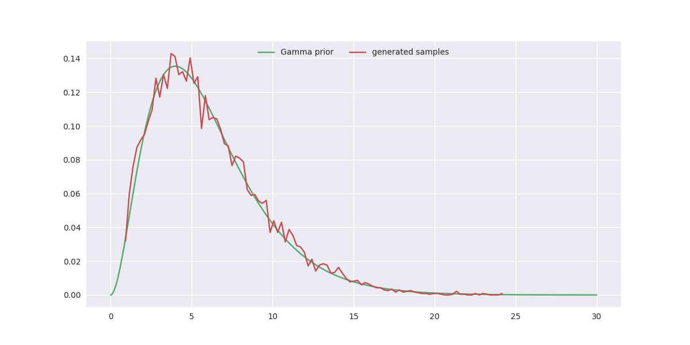

# gan distribution tutorial
A simple tutorial of training GAN to model Gamma distribution 

## Requirements
* [Python 3.5](https://www.python.org/downloads/)
* [TensorFlow 0.13](https://www.tensorflow.org/install/)
* [Numpy](http://www.numpy.org/)
* [SciPy](http://www.scipy.org/install.html)


<br>


## Usage 

#### Clone this repository
```bash
$ git clone git@github.com:HeroKillerEver/gan_distribution_tutorial.git
$ cd gan_distribution_tutorial
```

#### Train the model
```bash
$ python main.py --mode='train' --shape=2. --scale=2.
```
##### note that shape and scale correspond $k$ and $\theta$ in Gamma distribution


#### Evaluate the model
```bash
$ python main.py --mode='eval' --shape=2. --scale=2.
```
##### shape and scale should remain the same as training

<br>

## Results




